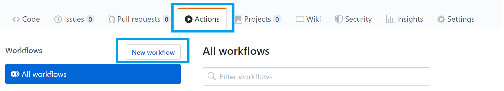

# Deploying a Python Web App from a Dev Container in VS Code using GitHub Actions

## Overview

The **Visual Studio Code Remote - Containers** extension lets you use a Docker container as a full-featured development environment. It allows you to open any folder inside (or mounted into) a container and use all of VS Code's features like IntelliSense, code navigation, and debugging.

**GitHub Actions** gives you the flexibility to build an automated software development lifecycle workflow. You can write individual tasks ("Actions") and combine them to create a custom workflow. Workflows are configurable automated processes that you can set up in your repository to build, test, package, release, or deploy any project on GitHub.

With **GitHub Actions** you can build end-to-end continuous integration (CI) and continuous deployment (CD) capabilities directly in your repository. 

### What’s covered in this lab
In this lab, you will:

1. Work on a Python web app inside the Remote-Containers extension in VS Code 

1. Deploy the web app to Azure using the App Service extension

1. Create a workflow with GitHub Actions to add CI/CD to your app


### Prerequisites

1. Your Windows machine should have Python 3.7, Docker, and Visual Studio Code, and the VS Code Remote Development extensions installed. 

1. You are using a GitHub account and an Azure account made for the purposes of this lab. These have been already logged into from your machine and the account info is saved.

### Setting up the GitHub repo

"The Cat Said No" is a simple Python Flask web app. 

1. Go to https://github.com/sana-ajani/theCatSaidNo_GHUniverse. Click the "Fork" button in the upper-right hand corner. From there, click the green "Clone" button and copy the URL.

   


1. Open up the Windows Terminal and run the following command, pasting in the link you just copied.

    ```cmd
    git clone <pasted URL>
    ```

1. Open the repo in Visual Studio Code. 

    ```
    cd theCatSaidNo_GHUniverse

    code . 
    ```

## Open the dev container workspace

1. Notice the repo has a `.devcontainer` folder which contains a `Dockerfile` and a `devcontainer.json`. The dev container tells VS Code how to create a development container that has a specific runtime, extensions, and tools. In this case, the dev container is Python specific and tells VS Code to install the Python and Azure App Service extensions. 

1. Click the `Reopen in Container` prompt, or press `F1` and select the `Reopen folder in dev container` command.  

   

1. Click on "Details" to see what is happening when VS Code is creating the container. VS Code is installing a component called "VS Code Server" in the container so you can directly interact with code, the file system, and extensions in the remote workspace. Since this is the first time we are creating it, it'll take a few minutes (but the next time you reconnect to an existing container will be pretty quick).

1. Notice the indicator in the bottom left corner tells us we are inside our dev container.

   


1. Press `F1` and run the command "Open new terminal". Once you are in the new terminal instance, notice we're actually in Bash! Type the command `uname` to see that we're in a Linux environment right now. Run the command `python --version` to check that the version of Python in our remote container is different than the one that is on our local machine. 

   

1. Press `F5` to run the app inside the container

1. Open up Edge and go to [`localhost:9000`](http://localhost:9000/) and try out the app! 


## Create an Azure App Service

Instead of running this locally, let's create this as a web app hosted in Azure. 

1. Stop the app running locally by clicking on the red square in the debug toolbar. 

   

1. Click on the Azure icon in the sidebar. 

   


1. Click on the `+` icon to create a new app service under the **VSCode GitHub Universe HOL** subscription.

   


1. Give your webapp a unique name (we recommend calling it **YOUR_NAME-theCatSaidNo** )

1. Select **Linux** as your OS and **Python 3.7** as your runtime. 

1. It will take a minute or two to create the app. Once it's done, you'll get a prompt to browse to your new site. Click on "View output" and open the link to your site. 

    >Note: If creation of the app is taking a bit longer than you expect, call one of the proctors and we'll switch you to an already created app

1. The page you browse to will be the default site you see, since we haven't yet deployed anything to the site.

    


## Set up CI/CD with GitHub Actions 

We'll use GitHub actions to automate our deployment workflow for this web app. 

1. Inside the App Service extension, right click on the name of your app service and choose "Open in Portal".

   

1. From the Overview page, click on "Get publish profile". A publish profile is a kind of deployment credential, useful when you don't own the Azure subscription. 

   

1. Open the settings file you just downloaded in VS Code and copy the contents of the file.

1. We will now add the publish profile as a secret associated with this repo. On the GitHub repository, click on the "Settings" tab.

   


1. Go to "Secrets". Create a new secret and call it "LAB_PUBLISH_PROFILE". Paste the contents from the settings file.

   


1. Now click on "Actions" in the top bar. Under the "Popular continuous integration workflows" section, click on the "Workflows for Python, Maven, Docker, and more" button to open up more templates.  

   


1. Find the **Python application** template (not the Python Package one!) and select "Set up this workflow".

   

1. Now, paste these lines of code to the end of the `pythonapp.yml` file in GitHub. Change the `app-name` to the name of your web app. Here, we are using [GitHub Azure Actions](https://github.com/Azure/actions/blob/master/README.md) to login to Azure with the publish profile we stored in GitHub secrets previously.

    ```yml
    - uses: azure/webapps-deploy@v1
      with:
          app-name:  # Replace with your app name
          publish-profile: ${{ secrets.LAB_PUBLISH_PROFILE }}
    ```

   

1. Once you're done, click on "Start commit". Fill in the text box with a commit message, and then click the "Commit change" button, which will trigger the workflow.

1. While the Action is being queued, let's get into the details of what this workflow is actually doing. Go to the `.github/workflows/pythonapp.yml` file to follow along. 

   - **Workflow Triggers (line 3)**: Your workflow is set up to run on "push" events to the branch
     
     ```yaml
        on: [push]
     ```

     For more information, see [Events that trigger workflows](https://help.github.com/articles/events-that-trigger-workflows).
   
   - **Running your jobs on hosted runners (line 8):** GitHub Actions provides hosted runners for Linux, Windows, and macOS. We specify the hosted runner in our workflow as below.

       ```yaml
       jobs:
        build:
        runs-on: ubuntu-latest

      ```
   - **Using an action (line 11)**: Actions are reusable units of code that can be built and distributed by anyone on GitHub. To use an action, you must specify the repository that contains the action. We are also specifying the version of Python runtime. 
      
      ```yaml
      - uses: actions/checkout@v1
       - name: Set up Python 3.7
         uses: actions/setup-python@v1
         with:
            python-version: 3.7
      ```

   - **Running a command (line 16)**: You can run commands on the job's virtual machine. We are running the Python commands below to install the dependencies from our requirements.txt, and lint and test our application.

      ```yaml
        - name: Install dependencies
        run: 
            python -m pip install --upgrade pip
            pip install -r requirements.txt
        - name: Lint with flake8
         run: 
            pip install flake8
            # stop the build if there are Python syntax errors or undefined names
            flake8 . --count --select=E9,F63,F7,F82 --show-source --statistics
            # exit-zero treats all errors as warnings. The GitHub editor is 127 chars wide
            flake8 . --count --exit-zero --max-complexity=10 --max-line-length=127 --statistics
        - name: Test with pytest
         run: 
            pip install pytest
            pytest
     ```

    >For workflow syntax for GitHub Actions see [here](https://help.github.com/en/github/automating-your-workflow-with-github-actions/workflow-syntax-for-github-actions)

1. You can go back to the Actions tab, click on your workflow, and see that the workflow is queued or being deployed. Wait for the job to complete successfully before going back to your website. 

   

## Test out your app!

1. Back in VS Code, go to the App Service extension, and right click on your app service and click on "Browse Website". 

1. Let's test our GitHub Actions workflow we just made. Add the following lines of code to `templates/home.html` in the body class, after we load in the catpaw image:

    ```html
    <div>
        <h1 style="text-align:center;"> Press the button!<h1>
    </div>
    ```

    


1. In the terminal, run the following commands:

    ```cmd
    git pull
    git add .
    git commit -m "test ci/cd"
    git push
    ```

1. Go back to the Actions tab and you can watch the build finishing up. Once you see all the green check marks, go to Edge and browse to your new website!
